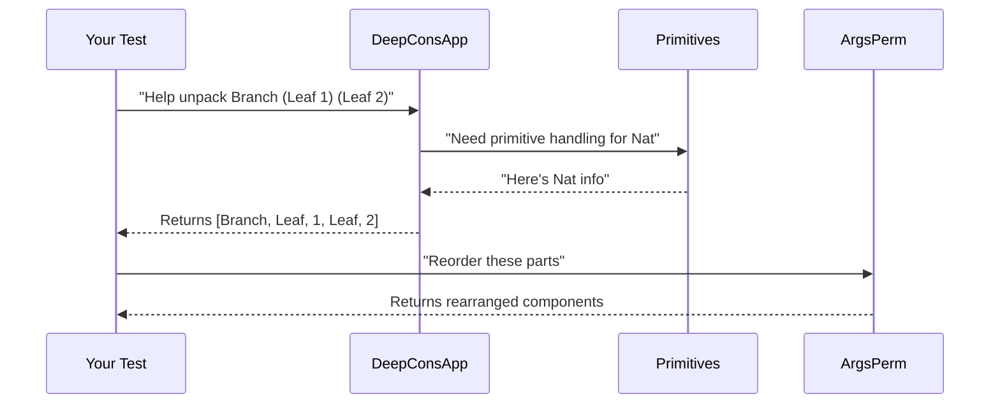

# Chapter 2: Utility Toolkit

Welcome back! In [Chapter 1](01_gen_monad_and_combinators_.md), we learned how `Gen` helps create random test data like a magical recipe book. Now imagine you're baking a complex cake - you'll need specialized tools like measuring cups and mixers! That's exactly what our Utility Toolkit provides for metaprogramming tasks.

## Why Do We Need Special Tools?

Let's say we're testing a function that works with nested data structures like this:

```idris
data Nested = Leaf Nat | Branch Nested Nested
```

To generate random `Nested` values, we need to:
1. Understand constructor arguments deeply
2. Handle primitive types like `Nat` correctly
3. Reorder arguments when needed
4. Track how values are constructed

Our toolkit provides these specialized helpers!

## Meet the Tools

### 1. Constructor Deep-Dive (`DeepConsApp`)

Imagine you're unpacking a Russian nesting doll. `analyseDeepConsApp` helps examine complex expressions by breaking them down layer by layer:

```idris
-- Simplified example: Analyzing (Leaf 5)
analyseDeepConsApp freeNames (Leaf 5)
-- Finds: [Leaf, 5] with dependency info
```

This helps us understand how values are built from smaller pieces.

### 2. Primitive Type Helpers (`Primitives`)

Some types like `Int` or `String` are built into Idris. This module helps handle them properly:

```idris
-- Gets special handling for primitive types
typeInfoForPrimType IntType
-- Returns simplified type info for integers
```

### 3. Argument Rearranger (`ArgsPerm`)

Sometimes we need to reorder arguments like shuffling cards. The `reorder` function helps with this:

```idris
-- Reorder arguments [A, B, C] using pattern [2,0,1]
reorder [2,0,1] [A, B, C] -- Returns [C, A, B]
```

### 4. Generator Labeling (`Labels`)

When combining generators, we can add labels like name tags to track what's what:

```idris
-- Add label to a generator
labelGen "numbers" smallNumbers
```

## How They Work Together

Imagine building a complex generator for our `Nested` type:



## Behind the Scenes

Let's peek at how `analyseDeepConsApp` works (simplified):

```idris
analyseDeepConsApp : 
  (freeNames: Names to track) -> 
  (expression: TTImp) -> 
  Result
analyseDeepConsApp names expr = case expr of
  IVar name => if name in names then track name
  IApp func arg => analyse func >> analyse arg
  -- ... other cases
```

Key steps:
1. Break expressions into smaller parts
2. Track which names are used
3. Rebuild the structure with dependency info

## What We've Learned

Today we've added specialized tools to our metaprogramming toolbox:
- `DeepConsApp` for unpacking complex expressions
- `Primitives` for handling built-in types
- `ArgsPerm` for rearranging arguments
- `Labels` for tracking generator components

These utilities help us build smarter generators that understand how data is structured. Ready to analyze function signatures? Let's explore [Signature Analysis](03_signature_analysis_.md) next!

---

Generated by [AI Codebase Knowledge Builder](https://github.com/The-Pocket/Tutorial-Codebase-Knowledge)