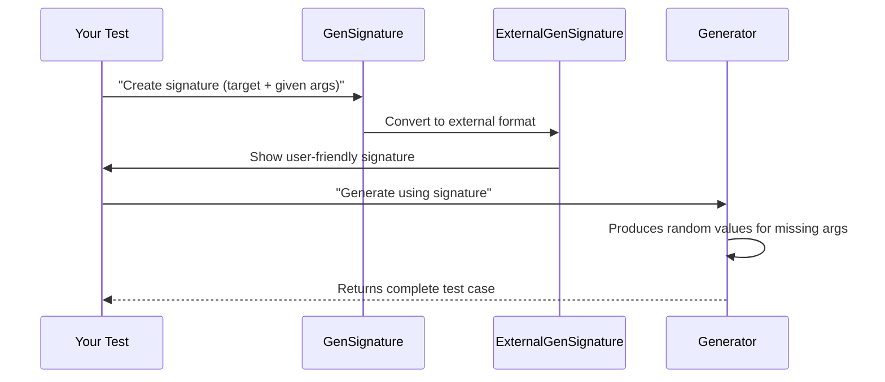

# Chapter 3: Signature Analysis

Welcome back! In [Chapter 2](02_utility_toolkit_.md), we learned how specialized tools help unpack complex data structures. Now imagine you're ordering a custom pizza 🍕 - you need to specify what toppings you already have (like cheese) and what the chef should generate (like random veggies). That's exactly what Signature Analysis helps us do with generators!

## Why Do We Need Signature Analysis?

Let's say we're testing a function that formats user profiles:
```idris
formatProfile : (name : String) -> (age : Nat) -> (email : String) -> String
```

When generating test data:
- Some arguments might be provided (like `name` from a known list)
- Others need random generation (like `age` and `email`)

Signature Analysis helps us:
1. Track which arguments are given vs generated
2. Handle argument ordering (explicit vs implicit)
3. Create precise generator recipes

## Meet the Signature Duo

### GenSignature - The Internal Recipe

Think of `GenSignature` as the chef's private recipe card. It tracks:
- The target type (`formatProfile` in our example)
- Which arguments are provided ("given" parameters)
- Which need generation ("generated" parameters)

Here's how we define it:
```idris
record GenSignature where
  constructor MkGenSignature
  targetType : TypeInfo    -- What we're generating
  givenParams : SortedSet (Fin args.length) -- Positions of provided args
```

For our `formatProfile` example:
- `targetType` = info about `formatProfile`
- `givenParams` = positions of provided args (e.g., position 0 for `name`)

### ExternalGenSignature - The Customer Menu

While `GenSignature` is internal, `ExternalGenSignature` is what users see - like a restaurant menu showing available options:

```idris
record ExternalGenSignature where
  constructor MkExternalGenSignature
  targetType : TypeInfo
  givenParams : SortedMap (Fin args.length) (ArgExplicitness, Name)
  givensOrder : Vect givenParams.size (Fin givenParams.size)
  gendOrder   : Vect gendParamsCnt (Fin gendParamsCnt)
```

Key differences:
- Tracks argument names (`name`, `age`, `email`)
- Remembers argument order (important for calling functions!)
- Handles explicit vs implicit arguments

## How To Use Signatures

Let's create a signature for generating `formatProfile` tests where only `name` is provided:

```idris
-- Create signature for formatProfile with name given
profileSig : GenSignature
profileSig = MkGenSignature formatProfileInfo [0]  -- Position 0 = name
```

Now we can:
1. See which parameters need generation
```idris
generated = profileSig.generatedParams -- Returns [1,2] (age & email)
```

2. Convert to external signature for user-friendly display
```idris
externalSig : ExternalGenSignature
externalSig = internalise profileSig  -- Adds names/ordering
```

## Behind the Scenes: Signature Lifecycle

When we use a signature, here's what happens:



## Signature Internals Explained

Let's peek at key parts of the implementation (simplified):

**1. Creating a canonical signature** - This builds the complete generator type:
```idris
canonicSig : GenSignature -> TTImp
canonicSig sig = piAll returnTy $ 
  MkArg MW ExplicitArg Nothing `(Fuel) 
  :: (arg <$> toList sig.givenParams)
```
This creates a function type that takes `Fuel` (controls randomness) and given parameters, returning a generator for missing args.

**2. Calling generators** - How we use signatures to run generators:
```idris
callCanonic : (sig : GenSignature) -> (name : Name) -> 
              (fuel : TTImp) -> Vect sig.givenParams.size TTImp -> TTImp
callCanonic sig name fuel values = 
  foldl app (app name fuel) values
```
This builds the function call by applying fuel and given values.

**3. External signature conversion** - Making signatures user-friendly:
```idris
internalise : ExternalGenSignature -> GenSignature
internalise extSig = MkGenSignature 
  extSig.targetType 
  (keys extSig.givenParams)
```
Converts the external representation to internal by extracting given parameters.

## What We've Learned

Today we've discovered:
- `GenSignature` tracks target types and given/generated parameters
- `ExternalGenSignature` adds user-friendly details like names and ordering
- How to create and convert between signature types
- The internal process of building and calling generators via signatures

Signatures are like custom order forms for generators - they tell our test kitchen exactly what ingredients we have and what needs to be prepared fresh! Ready to dive deeper into constructor analysis? Let's explore [ConsRecs (Constructor Recursiveness)](04_consrecs__constructor_recursiveness__.md) next!

---

Generated by [AI Codebase Knowledge Builder](https://github.com/The-Pocket/Tutorial-Codebase-Knowledge)