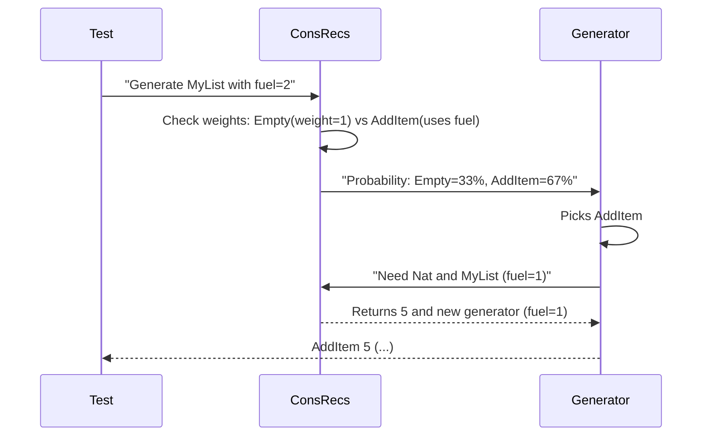

# Chapter 4: ConsRecs (Constructor Recursiveness)

In our last adventure on [Signature Analysis](03_signature_analysis_.md), we learned how to order ingredients for our test recipes. Now imagine baking a fractal cake 🎂 - each layer contains smaller versions of itself! How do we generate such recursive structures without creating infinite cakes? Meet `ConsRecs` - our recursion accountant!

## Why We Need a Recursion Accountant

Consider a simple list structure:
```idris
data MyList = Empty | AddItem Nat MyList
```

If we randomly generate `MyList`:
- We might get `AddItem 5 (AddItem 3 (AddItem 7 ...))` forever!
- We need to control recursion depth
- We want balanced probabilities (not always choosing `AddItem`)

`ConsRecs` solves these problems by:
1. Tracking "fuel" to limit recursion depth
2. Calculating weights for constructor choices
3. Handling structurally decreasing arguments

## Meet the Recursion Accountant

`ConsRecs` has two main components:

### 1. ConWeightInfo - The Weight Ledger
Tracks how "heavy" each constructor is:
```idris
record ConWeightInfo where
  weight : Either Nat1 RecWeightInfo  -- Simple number or complex weight
```

- `Nat1` (like 1,2,3) for non-recursive constructors
- `RecWeightInfo` for recursive ones

### 2. RecWeightInfo - The Fuel Manager
Handles recursive cases:
```idris
data RecWeightInfo = 
  SpendingFuel (Fuel -> Nat1)        -- Uses fuel directly
  | StructurallyDecreasing TypeInfo  -- Uses decreasing size
```

Think of these as different payment methods for our recursion costs!

## How ConsRecs Works

Let's generate `MyList` with fuel=2:


Key steps:
1. Consults weight ledger (`ConWeightInfo`)
2. Adjusts probabilities based on remaining fuel
3. For recursive calls, reduces fuel by 1

## Using ConsRecs in Practice

Here's how we'd look up weights for our `MyList`:

```idris
-- Get weight info for MyList constructors
getWeights : GenSignature -> Maybe (List (Con, ConWeightInfo))
getWeights sig = lookupConsWithWeight sig
```

For `MyList` this might return:
- `Empty` with weight `Left 1` (always weight 1)
- `AddItem` with `SpendingFuel` strategy

## Behind the Scenes: Building ConsRecs

The magic happens in `getConsRecs`:

```idris
getConsRecs : Elaboration m => m ConsRecs
getConsRecs = do
  -- Collect info for all types
  for eachType $ \targetType => do
    for eachConstructor $ \con => do
      if isRecursive con
        then markRecursive con
        else markNonRecursive con
  -- Build final weight mappings
  pure MkConsRecs finalMappings deriveWeightingFun
```

Key steps:
1. Checks if constructor is recursive
2. Assigns appropriate weight strategy
3. Builds mapping of all constructors

## Fuel Management Strategies

### SpendingFuel - The Simple Way
```idris
SpendingFuel $ \fuel -> leftDepth fuel
```
Uses remaining fuel directly to calculate weight

### StructurallyDecreasing - The Smart Way
```idris
StructurallyDecreasing decrTy weightExpr
```
Uses decreasing argument size (like list length) to calculate weight

## What We've Learned

Today we've discovered:
- Why recursive types need special handling
- How `ConsRecs` acts as a recursion accountant
- The `ConWeightInfo` and `RecWeightInfo` records
- Fuel management strategies (`SpendingFuel` vs `StructurallyDecreasing`)
- How to access constructor weights with `lookupConsWithWeight`

`ConsRecs` ensures our recursive generators terminate gracefully while producing balanced test cases. Ready to automate generator creation? Let's explore the [Automatic Derivation Framework](05_automatic_derivation_framework_.md) next!

---

Generated by [AI Codebase Knowledge Builder](https://github.com/The-Pocket/Tutorial-Codebase-Knowledge)