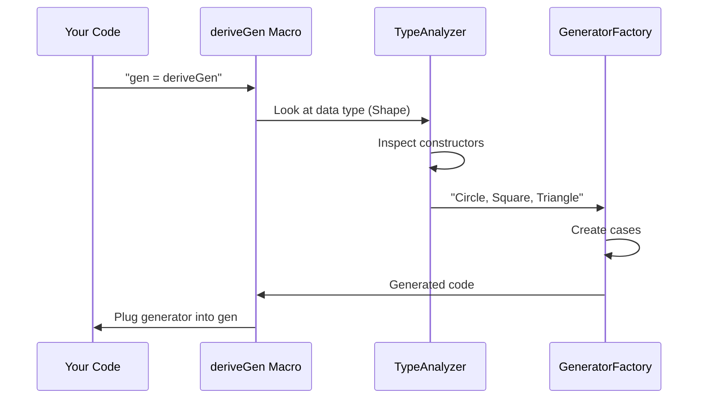

# Chapter 5: Automatic Derivation Framework

Welcome back! After learning how `ConsRecs` manages recursive types in [Chapter 4](04_consrecs__constructor_recursiveness__.md), you might wonder: *"Wouldn't it be amazing to automatically generate custom generators instead of building them from scratch?"* That's exactly what our **Automatic Derivation Framework** does! 🪄

## Why Do We Need Automatic Generators?

Imagine you're testing a program that works with expressions:
```idris
data Expr = Num Int | Add Expr Expr | If Bool Expr Expr
```

Manually creating a generator for this would be tedious:
1. Handle recursive cases with fuel
2. Balance probabilities for each constructor
3. Manage all argument types

The Automatic Derivation Framework handles this *for you* with just one magic command: `deriveGen`!

```idris
genExpr : Fuel -> Gen Expr
genExpr = deriveGen  -- That's it!
```

The framework automatically:
- 📝 Analyzes your data type (`Expr`)
- 🧩 Builds a tailored generator
- 🔄 Handles recursion, probabilities, and types
- 🎯 Works for any custom data type!

## Meet the `deriveGen` Macro

`deriveGen` is your magic wand - wave it over your data type, and presto! A generator appears:

```idris
data Shape = Circle | Square | Triangle

-- Your new generator:
genShape : Fuel -> Gen Shape
genShape = deriveGen
```

Under the hood, `deriveGen` becomes:
```idris
-- Automatically generated:
genShape _ = frequency
  [ (1, pure Circle)
  , (1, pure Square)
  , (1, pure Triangle)
]
```

## How It Works: The Magic Behind the Scenes

When you run `deriveGen`, this happens:



### Step-by-Step Breakdown
1. **Analyze the type** - What constructors exist? (Circle, Square, Triangle)
2. **Check generatables** - Do they need recursion? Fuel? (`genShape` ignores fuel)
3. **Assign weights** - Each constructor gets equal weight by default
4. **Build generator** - Combine pieces using `frequency`

## Real Example: Recursive Expressions

For our `Expr` type, `deriveGen` creates:

```idris
genExpr fuel = case fuel of
  Dry => pure Num ?number
  More f => frequency
    [ (1, [| Num ?intGen |])
    , (2, [| Add (genExpr f) (genExpr f) |])
    , (2, [| If ?boolGen (genExpr f) (genExpr f) |])
]
```

Note it automatically:
- Uses `fuel` for recursion
- Assigns higher weights to complex constructors
- Mixes argument generators (`?intGen`, `?boolGen`)

## Peek Under the Hood: Key Code Files

The wizardry happens in these core files:

### `src/Deriving/DepTyCheck/Gen.idr`
The entry point with `deriveGen`:

```idris
||| Derive `Gen` automatically for any type
export %macro
deriveGen : Elaboration a
deriveGen = do
  signature <- getSignature      -- Get type info
  generateGen signature          -- Build generator
```

### `src/Deriving/DepTyCheck/Gen/ForOneType.Impl.idr`
Where the magic happens:

```idris
canonicBody : GenSignature -> List Clause
canonicBody sig = do
  -- Build generator cases for each constructor
  for sig.targetType.cons $ \con => do
    weights <- getConsWeights con  -- Get weights from ConsRecs
    buildConstructorGen con weights
```

## What We've Learned

Today we've unlocked the magic of automatic generator creation:

- ✨ Use `deriveGen` to instantly create generators
- 🔍 The framework analyzes your data type's structure
- 🛠️ Automatically handles recursion with fuel
- ⚖️ Balances probabilities using ConsRecs
- 🧩 Builds generators using our toolkit components

The Automatic Derivation Framework is your ultimate tool for painless property-based testing! But how do we know if our generators create *good* test data? Let's explore [Coverage Tracking](06_coverage_tracking_.md) next!

---

Generated by [AI Codebase Knowledge Builder](https://github.com/The-Pocket/Tutorial-Codebase-Knowledge)