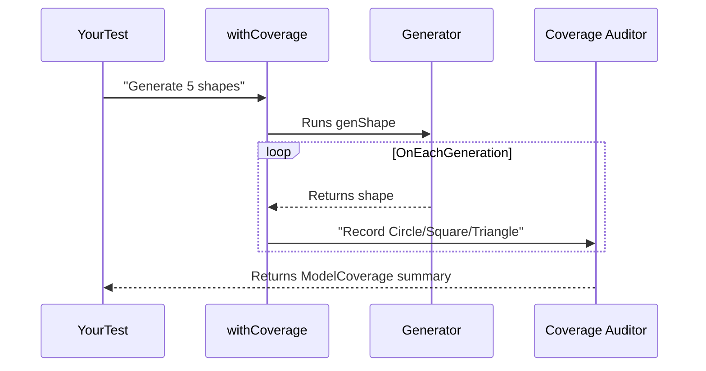

# Chapter 6: Coverage Tracking

Hello testers! 👋 In our last chapter, we learned about [Automatic Generators](05_automatic_derivation_framework_.md) which create test cases like magic. But have you ever wondered, "Did I test *every part* of my program?" That's where *Coverage Tracking* comes in! 🧐

Imagine you're taste-testing a batch of cookies. You wouldn't just eat one cookie - you'd want to sample several to ensure *all* match the recipe. Similarly, coverage tracking shows you all parts of your data types that were exercised during testing, ensuring your generators don't miss important ingredients!

## Why Track Coverage?

Consider this simple shape generator we created earlier:

```idris
data Shape = Circle | Square | Triangle

genShape : Fuel -> Gen Shape
genShape _ = frequency
  [ (1, pure Circle)
  , (1, pure Square)
  ]
```

Did you spot the issue? We're *never generating* triangles! Without coverage tracking, this might go unnoticed. Our coverage system acts like:
- 👁️ A watchful eye that tags every generated piece
- 📊 A label counter that tracks what gets created
- 📈 A reporter showcasing what's missing

Let's see how to activate this auditor!

## Your First Label

The core concept is the `label` combinator:

```idris
import Test.DepTyCheck.Gen.Coverage

labeledGen : Gen NonEmpty Shape
labeledGen = do
  shape <- genShape fuel
  label "Circle was generated" shape
  pure shape
```

This literally says: "When we generate a Circle, attach a 'Circle was generated' label!"

But manually labeling every constructor is tedious. Our macro automates it:

```idris
autoLabeled : Fuel -> Gen em Shape
autoLabeled = withCoverage genShape
```

The `withCoverage` macro automatically labels:
- Types ("Shape")
- Constructor names ("Circle", "Square", "Triangle")

## Tracking Results with ModelCoverage

When we run tests labeled by `withCoverage`, results populate a `ModelCoverage` record counting label hits:

```idris
runTests : IO ()
runTests = do
  results <- pick 10 autoLabeled
  print coverageSummary
```

Example output after 5 runs:
```
Shape: 5 hits
├── Circle: 2
├── Square: 3
└── Triangle: 0
```

This reveals our triangle was never generated! 🚨

## Behind the Scenes: Coverage Pipeline

Here's what happens when using `withCoverage`:



## Visualization Tools

The `CoverageGenInfo` package provides beautiful visualization:

```idris
fullReport : CoverageGenInfo -> String
fullReport = show @{Colourful}
```

For our broken shape generator, this colorful output shows:
- ✅ Covered types in green
- ⛔ Missing constructors in red
- 📊 Hit count statistics

## Documentation Integration

The `.readthedocs.yaml` configuration generates professional reports that integrate directly into your documentation site:

```yaml
sphinx:
  configuration: docs/source/conf.py
  builder: dirhtml
```

After testing, your ReadTheDocs site will display coverage reports alongside API docs!

## Real Implementation Snippets

How labels are internally applied:

```idris
-- Simplified version
attachLabel : Label -> Gen em a -> Gen em a
attachLabel lbl gen = do
  result <- gen
  tell (MkModelCoverage $ singleton lbl 1)
  pure result
```

How coverage maps are updated:

```idris
updateCoverage : ModelCoverage -> CoverageGenInfo -> CoverageGenInfo
updateCoverage hits info = record {
  constructorStats $= map (updateCountsFor hits)
  } info
```

Key files that power this:
- `src/Test/DepTyCheck/Gen/Coverage.idr` (core logic)
- `.readthedocs.yaml` (reporting setup) 

## What We've Learned

Today we gained our coverage auditor:
- 🏷️ Labeling generated values with `withCoverage`
- 📈 Tracking hits with `ModelCoverage`
- 📊 Visualizing with `CoverageGenInfo`
- 🌐 Integration with ReadTheDocs

Just like tasting every cookie in the batch ensures quality, coverage tracking ensures your generators exercise *every part* of your data types! In our next chapter, we'll explore adding to this foundation. Happy testing! 🥳

---

Generated by [AI Codebase Knowledge Builder](https://github.com/The-Pocket/Tutorial-Codebase-Knowledge)