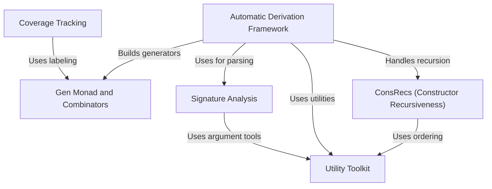

# Tutorial: code_to_analyze

This project is an **advanced property-based testing framework** for Idris 2 that automatically *derives generators* for custom data types, including complex dependent and recursive types. At its core is the `Gen` monad (Abstraction 0), which acts like a **random data factory** with precise emptiness control. Key innovations include:
- **Metaprogramming-driven derivation** (Abstraction 1) that analyzes type definitions
- **Coverage tracking** (Abstraction 4) to audit which types/constructors are tested
- Specialized handling of **recursive types** (Abstraction 5) via fuel consumption and probability weights
Utilities like argument permutation (Abstraction 3) and signature analysis (Abstraction 2) support these features.

**Source Repository:** [None](None)

## Chapters

1. [Gen Monad and Combinators
](01_gen_monad_and_combinators_.md)
2. [Utility Toolkit
](02_utility_toolkit_.md)
3. [Signature Analysis
](03_signature_analysis_.md)
4. [ConsRecs (Constructor Recursiveness)
](04_consrecs__constructor_recursiveness__.md)
5. [Automatic Derivation Framework
](05_automatic_derivation_framework_.md)
6. [Coverage Tracking
](06_coverage_tracking_.md)

---

Generated by [AI Codebase Knowledge Builder](https://github.com/The-Pocket/Tutorial-Codebase-Knowledge)