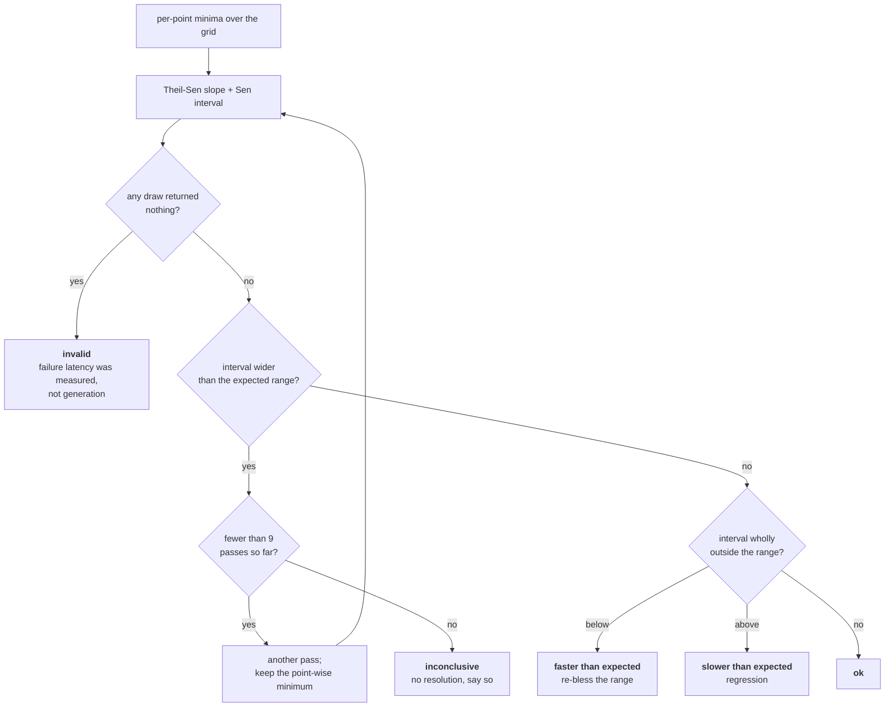

# Performance tests: measuring a complexity class on a noisy machine

These tests answer one question per subject: **is this generator still in the
complexity class we believe it is in?** They are golden tests like every other
test here — the verdict goes to stdout and is compared against `expected` —
but the verdict is produced by a statistical procedure rather than by
evaluation, so it is worth explaining what that procedure is and why it is the
right one.

Everything measured here comes from the investigation in
`deptycheck_investigation_unified.md`; section references below point into it.

## The problem

A GitHub-hosted runner is a shared virtual machine of unknown speed, with
unknown neighbours, subject to frequency scaling and to being descheduled. A
benchmark that asserts "this took less than 40 ms" on such a machine is a coin
flip. But the thing we actually care about is not a time — it is whether the
derived generator is still super-quadratic while the hand-written one is still
linear.

## Why the exponent is measurable although the time is not

Model the cost as `T(n) = c * n^b`. Then

```
log T(n) = log c + b * log n
```

so `b` is the slope of `log T` against `log n`, and it does not contain `c` at
all. Everything the runner lottery does to us — a slower CPU generation, a
throttled core, a container with less cache — multiplies `c` and leaves `b`
alone. That is the whole reason this suite is feasible: **the quantity we assert
on is invariant under exactly the perturbation we cannot control.**

What remains is per-point noise, and that is what the rest of the design is
about.

## Estimator: Theil–Sen, not least squares

The slope is estimated as the **median of the slopes of all pairs of points**
(Theil 1950, Sen 1968).

Its breakdown point is about 29%: up to roughly a third of the sweep can be
arbitrarily corrupted without moving the answer. That is precisely the shape of
the noise we get. A co-tenant waking up, or a garbage collection landing on one
point, inflates a few points of the sweep and leaves the rest untouched — the
investigation hit this repeatedly, and section 8.3 item 2 records that the
spikes even move between otherwise identical runs. Ordinary least squares has a
breakdown point of **zero**: a single inflated point tilts the entire fit, in
the direction of a larger exponent, i.e. towards a false regression report.

Least squares would also be the wrong likelihood here even without spikes: it
assumes additive Gaussian errors with constant variance, whereas timing noise
is multiplicative, one-sided and strongly right-skewed.

## Aggregation over repetitions: minimum, not mean

Each grid point is measured in several passes and the **minimum** is kept.

Interference on a shared machine can only ever _add_ time; nothing a neighbour
does can make our code run faster than it does undisturbed. The noise is
therefore one-sided, and under a one-sided error the minimum of several
observations is the natural estimator of the undisturbed cost — and it has far
lower variance than the mean, which averages every spike straight back in.

The investigation used the arithmetic mean, which is the right choice for its
purpose: it was describing how a particular machine actually behaves. Here we
want the machine out of the way, so the minimum is the better estimator.

## Interval: Sen's distribution-free confidence interval

With the `N = m(m-1)/2` pairwise slopes sorted ascending, the bounds are the
order statistics at ranks `(N ∓ C)/2`, where `C = z(1-α/2) · σ(S)` and
`σ²(S) = m(m-1)(2m+5)/18` is the variance of Kendall's `S` statistic. `α` is
fixed at 5%, so `z(0.975)` is a named constant rather than something computed —
which also keeps `summary-stat`, and through it a binding to libm, out of a
benchmark's dependencies.

Why this interval:

- **It assumes nothing about the noise distribution.** Only that the residuals
  are independent and identically distributed. No normality, no equal
  variances. We do not know the distribution of runner noise and cannot
  usefully pretend that we do.
- **It is exact for equally spaced abscissae**, which is why every grid is
  geometric: a step of `√2` makes `log n` equally spaced. This also gives two
  points per doubling, which is what distinguishes "the exponent is still
  climbing" from "the exponent has settled" (section 8.2).
- **The normal approximation to `S` needs enough points**, which is why every
  grid carries at least eight, and most carry ten or eleven.
- Ranks are rounded **outwards**, so the interval errs towards being too wide,
  i.e. towards _not_ reporting a change.

On the investigation's own data the resulting half-widths are 0.08 to 0.42, and
on a clean run of this harness they are 0.01 to 0.31 — against a gap of about one
whole power of `n` between the classes that have to be told apart. There is
between three and a hundred times more resolution than the decision needs.

## The decision rule, and which way it fails

For each subject:

1. If the interval is wider than the expected range it is checked against →
   **inconclusive**.
2. Else if the interval lies wholly below the range → **faster than expected**.
3. Else if it lies wholly above the range → **slower than expected**.
4. Else → **ok**.

Two things about this are deliberate.

**A subject fails only on positive evidence.** The test does not ask "can I
prove the exponent is what I expect" — under that framing a noisy runner
produces a wide interval, fails to prove equivalence, and the build goes red for
no reason. It asks "can I prove the exponent moved". Noise widens the interval,
and a wide interval overlaps the range, so noise pushes the verdict towards
_pass_. This suite cannot fail because a runner had a bad minute; only because
the complexity really changed.



**Which is exactly why step 1 exists.** A gate whose failure mode is "pass"
rots into decoration, and reporting `ok` from a measurement with no resolution
would be a lie. Step 1 makes that case loud instead of silent.

Step 1's threshold is the range's own width rather than a constant, which makes
it a statement about resolution: an interval as wide as the range is one where an
exponent sitting dead centre could still reach outside it, and where an exponent
a whole class away could still overlap it. The question being asked is narrower
for the subjects whose reference exponent is known more precisely — which is
exactly when the range is narrow — so the requirement tightens with it. In
practice every subject has between three and nine times the resolution this
demands.

**An improvement fails too.** `faster than expected` is a failure, and that is
intended: a complexity improvement is a change in documented behaviour, and the
range has to be re-blessed just as a golden file does. If the upstream fix for
the singleton `oneOf` lands, `perf/oneof-recursion-edge` goes red, and
that is how you find out it worked.

### Why the expectation is an interval and not a point

The obvious procedure is the one in the textbooks: estimate the exponent, build a
confidence interval, and check that the hypothesised complexity lies inside it —
a two-sided test of `H₀: b = b₀`, rejected when `b₀` falls outside the interval.
That is the right test when a `b₀` exists and the power law is exact. Here
neither holds, and applying it to our own calibration data shows what goes wrong.
These are the six subjects that are linear by construction, tested against
`b₀ = 1`:

| subject | interval | contains 1? |
| --- | --- | --- |
| `genXByHand` | [1.000, 1.018] | only at the rounding |
| `genXMap` | [0.992, 1.018] | yes |
| `genXAp` | [1.002, 1.016] | **no** |
| `genXOneOfOffEdge` | [0.825, 0.945] | **no** |
| `genXOneOfInBase` | [1.008, 1.056] | **no** |
| `genDegenerateLists` | [1.038, 1.086] | **no** |

Four hand-written linear generators are declared non-linear, on a quiet machine,
with nothing wrong. The measurements are not at fault:

**A confidence interval covers sampling noise, not model error.** Sen's interval
answers "where is the slope of _this_ log-log curve", and answers it well —
±0.007 for `genXAp`. What it cannot cover is that `T = c·n^b` is an
approximation. A real generator has a fixed per-draw cost, allocation that is not
exactly proportional, cache behaviour that changes with `n`. Its finite-range
slope genuinely _is_ 1.009 rather than 1.000. So as the measurement improves, the
interval shrinks around a value that was never the integer, and a point-null test
becomes _more_ likely to fail the more carefully you measure. That is the wrong
way round for a gate. It also interacts badly with escalation below: `measure`
adds passes to narrow the interval, so under a point null the pass count would
choose the failure rate.

**For the expensive subjects there is no `b₀` to test against.** The
adjacent-point slopes of `genXOneOf2` run 2.42, 2.61, 2.81, 3.00, 3.22, 3.49,
3.59, 3.85, 3.85, 3.83 across its own grid: the curve is still bending, so no
single exponent describes it. Substituting the measured value instead is vacuous
— the interval is centred on it, so it always contains it and the test never
fires. "The expected exponents are range-local" below is the fuller version of
this point.

**What the suite has to detect is a change of class**, which is a shift of about
one in the exponent, and a point null cannot express "a difference smaller than
this does not interest me": its rejection region is set by measurement precision
rather than by what matters. So the null is an interval, and that interval is the
indifference zone — standard practice under the names interval (composite) null,
relevance test, or minimum-effect test; see the references section.

The two rules differ by exactly one term. Writing the interval as `e ± h` and the
expected range as `c ± w`, this suite passes when `|e − c| ≤ h + w`, and the
textbook test passes when `|e − b₀| ≤ h`. Identical, with `b₀ = c` and the
tolerance widened by `w`. The expected range is not an alternative to the
textbook procedure; it is the textbook procedure with the uninteresting drift
named out loud.

What it costs is power: nothing smaller than roughly half a class is detectable,
so a genuine 15% change in the exponent passes silently. And one caveat on how
`w` is currently obtained — the calibration below sets it from `h`, three
half-widths out from the measured value, which makes it a statement about this
machine's noise rather than about the class gap it ought to encode. Setting `w`
from the distance to the neighbouring class would be the principled version, and
would tighten several of the ranges.

### Escalation, and why it does not inflate the error rate

A subject runs at least 5 and at most 9 passes. Passes are added while the
interval is still too wide.

The stopping rule reads **only the width** of the interval, never where it sits
relative to the range. That distinction is the whole point. Stopping on width is
fixed-precision sampling: the significance level is untouched, because the
decision to keep sampling is independent of the outcome. Stopping on the
outcome — "keep sampling until it passes" — is optional stopping, and would
inflate the error rate without bound. The code is written so that the two
cannot be confused: `measure` consults `halfWidth` and nothing else.

## Measurement hygiene

Each of these corresponds to something that cost the investigation time.

- **Batching to a 30 ms window.** The number of draws per timed window is tuned
  upward until the window is at least 30 ms. This removes the microsecond clock
  floor that made every linear generator read as a flat 1 µs below n ≈ 1024
  (section 8.3 item 3) — instead of working around the floor by only measuring
  huge `n`. The count is fixed after calibration so all passes are comparable.
- **Calibration doubles as warm-up.** Everything it draws is discarded, so
  first-call effects cannot land in a measurement (section 8.3 item 1).
- **The result is forced inside the window.** Every subject reduces its value to
  a number by walking all of it. Matching on the outer constructor forces the
  constructor and nothing else, which is how the investigation ended up with a
  generator that appeared to be O(1) (section 7.3).
- **Randomised visit order.** Each pass visits the grid in a different
  pseudo-random order, from a fixed seed. Measuring ascending — the natural
  thing to write — makes any drift correlated with wall-clock time
  indistinguishable from a change of exponent.
- **Fixed generator seed.** The seed is a function of `n`, so the sequence of
  generated values, and hence the amount of work, is identical on every pass, on
  every runner, and in every rerun. For a branching generator such as the one
  for `NatList` this removes a whole source of variance the investigation lived
  with.
- **Misses are fatal, not averaged.** A generator that returns nothing measures
  failure latency rather than generation (section 8.3 item 7), so any miss makes
  the subject report `invalid`.
- **One runner per subject, `NUM_THREADS=1`.** Not a tuning choice: a second
  test running beside the first shows up in the first one's times.

## The expected exponents are range-local, not asymptotic

Each expected range is the exponent measured **over that subject's own grid**, which is
pinned in the test beside it. For the cheap subjects that is also the asymptotic
exponent. For the expensive ones it is not: `oneOf` with two live alternatives
settles at about 3.7, but only past n = 512, where one sample already costs
seconds — over the range affordable on CI it is still climbing and measures
about 2.9.

This is honest rather than sloppy. The statistic being asserted on is
"Theil–Sen slope of `log T` against `log n` over this specific grid", which is a
well-defined, reproducible quantity, and a change of complexity class moves it a
long way. What it is _not_ is a measurement of the asymptotic degree, and the
expected ranges must not be read as one. Widening a grid changes the expected
value, so grid and range change together.

Each range was set from two independent calibrations: a Theil–Sen fit over the
investigation's published averages restricted to the same range, and a clean run
of this harness. The two agree to within about 0.35 everywhere, and the clean
run reads consistently a little higher — which is expected, since the
investigation's low-`n` points sat on the microsecond clock floor and flattened
its slopes. Ranges are centred on the clean value, with at least two interval
half-widths of margin on each side (2.1 at the tightest, `genXOneOf2` and the
fuel-3 `genNatList`; 65 at the loosest), and each has been checked to exclude the
neighbouring class. For the highest-degree subjects nothing sits above them, so
their upper edge is set purely for margin and the discriminating edge is the
lower one.

| test | subject | grid | from §11 | measured | half-width | expected |
| --- | --- | --- | --- | --- | --- | --- |
| `hand-written-linear` | `genXByHand` | 512–16384 | 0.99 | 1.009 | 0.009 | 0.55–1.55 |
| `hand-written-linear` | `genXMap` | 512–16384 | 1.09 | 1.005 | 0.013 | 0.55–1.55 |
| `hand-written-linear` | `genXAp` | 512–16384 | 1.11 | 1.009 | 0.007 | 0.55–1.55 |
| `oneof-placement` | `genXOneOfOffEdge` | 512–16384 | 0.92 | 0.885 | 0.060 | 0.55–1.55 |
| `oneof-placement` | `genXOneOfInBase` | 512–16384 | 0.97 | 1.032 | 0.024 | 0.55–1.55 |
| `oneof-recursion-edge` | `genXOneOf1` | 128–2896 | 2.15 | 2.409 | 0.114 | 1.65–2.95 |
| `oneof-arity-two` | `genXOneOf2` | 16–512 | 2.89 | 3.316 | 0.289 | 2.30–4.20 |
| `derived-x` | `genX` (fuel 0) | 128–2896 | 2.15 | 2.233 | 0.105 | 1.65–2.95 |
| `derived-natlist` | `genNatList` (fuel 0) | 256–4096 | 2.08 | 2.326 | 0.078 | 1.60–2.95 |
| `derived-natlist` | `genNatList` (fuel 3) | 16–512 | 2.84 | 3.079 | 0.319 | 2.05–4.10 |
| `derived-natlist` | `genDegenerateLists` | 512–16384 | 1.05 | 1.062 | 0.024 | 0.55–1.55 |
| `oneof-arity-three` | `genXOneOf3` | 32–362 | 3.26 | 3.469 | 0.216 | 2.60–4.20 |
| `frequency-family` | `genXFreq1` | 128–2896 | 2.12 | 2.336 | 0.093 | 1.65–2.95 |
| `frequency-family` | `genXFreq2Const` | 16–362 | 2.90 | 3.205 | 0.290 | 2.25–4.20 |
| `frequency-family` | `genXFreq2Weighted` | 16–362 | 2.79 | 3.024 | 0.236 | 2.25–4.20 |

The `measured` column is one run on an Apple M4 Max, five passes per point, the
same hardware the investigation used. It is not a GitHub runner, and the constant
factors will not transfer — but the exponents should, and that is the claim the
design rests on. **The first run on a hosted runner is the one that confirms
it.** If a
subject reads more than about one half-width away from the value above on a
hosted runner, re-centre its range on what the runner actually measures and record
that here.

Every directory runs on every push and pull request. There is no slow tier: CI
gives each directory a runner of its own, so they run concurrently and the suite
costs the wall-clock of its slowest member — `derived-natlist`, at about 80 s of
measurement — rather than the sum. `oneof-arity-three` and `frequency-family`
were nightly-only until the per-directory times were measured and turned out to
be 28 s and 33 s, comfortably inside that.

Those two do add the least: arity three confirms the degree has stopped growing,
and the `frequency` family confirms that weights change the distribution and not
the complexity. What they catch is those confirmations *decoupling* from the
subjects they track.

## Failure triage

1. Read the job's stderr. It carries the number of passes, the misses, the
   expected range, the estimate with its interval, and the per-point times.
2. **`inconclusive`** — the runner was too noisy to decide, or the interval
   genuinely straddles two classes. Rerun once. If it recurs on a quiet runner,
   the subject's grid is too short and wants extending.
3. **`invalid`** — the generator produced no value. That is a functional bug or
   a fuel change, not a performance one; the timings mean nothing.
   `oneof-arity-two` and the fuel-3 `genNatList` subject are the two with the
   widest intervals, so they are where an `inconclusive` will show up first.
4. **`slower than expected`** — a real regression, or a range that was too tight.
   Compare the estimate against the calibrated value in the table above.
5. **`faster than expected`** — most likely a genuine improvement. Confirm it is
   intended, then move the range and say so in the commit message.
6. If _every_ subject in a job moves in the same direction, suspect the harness
   or the runner, not the library: these subjects do not share a mechanism.
